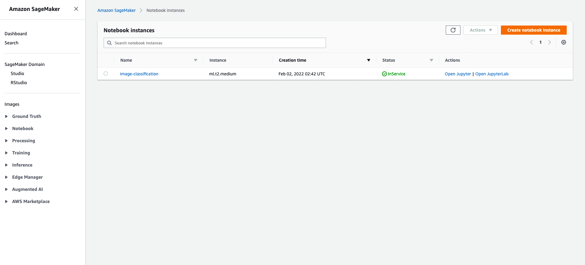
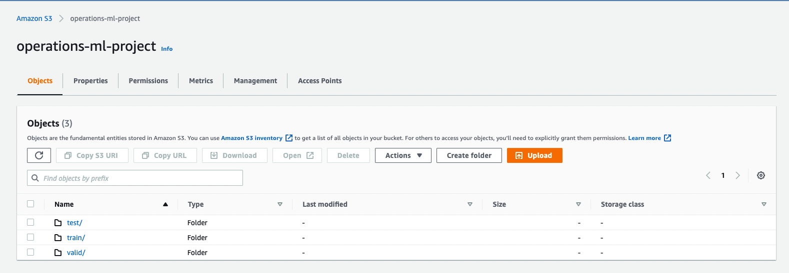
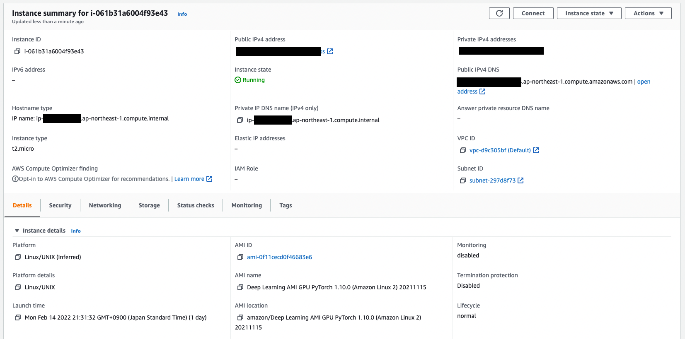
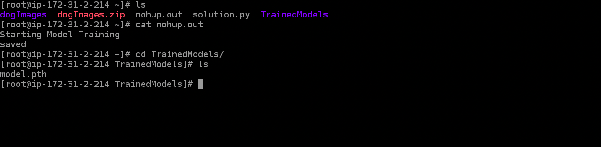
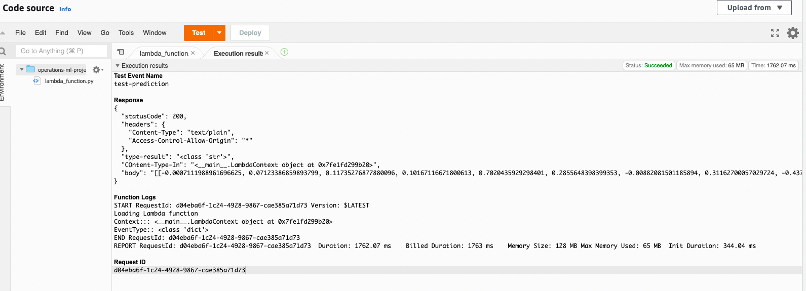
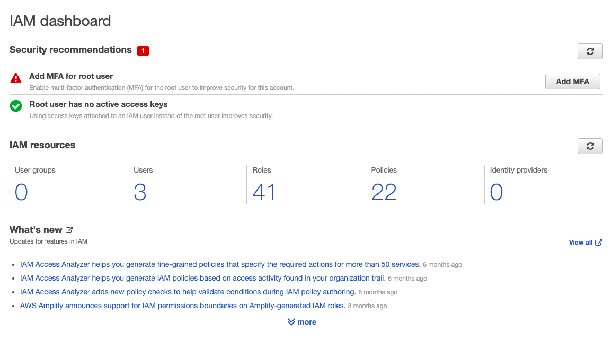
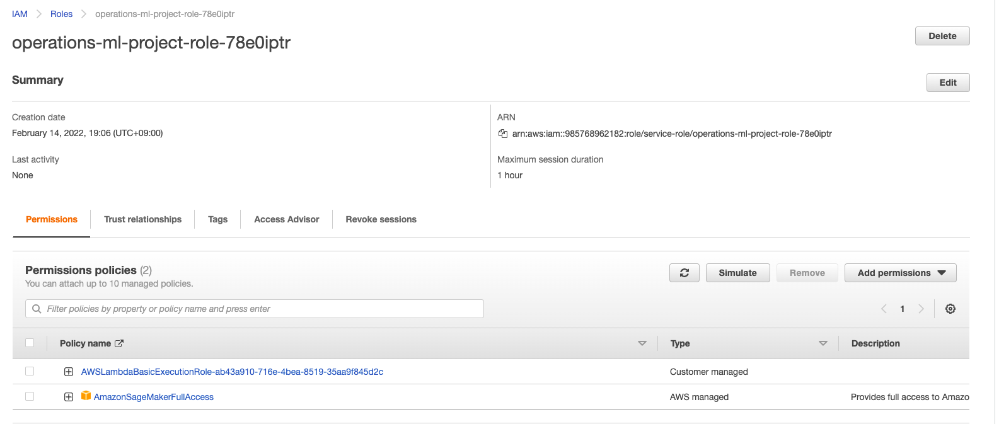
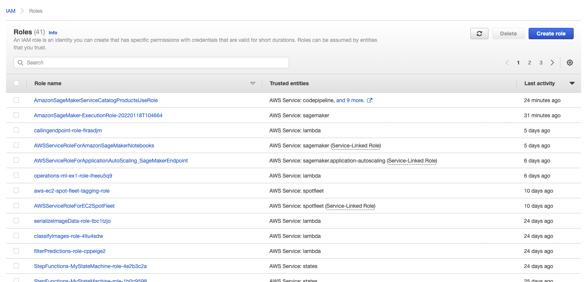
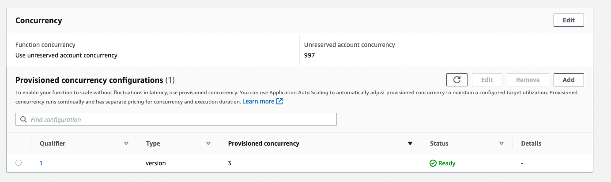
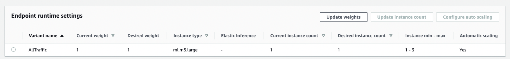

# Operations ML project

This project aims to outline some deployment considerations for a production grade image classification project.

There are different alternatives for the deployment of the model in AWS.

## SageMaker:

For this project it was created a notebook instance of the type ml.t2.medium due to its low cost of operation, which should be enough for the purposes of this project. The instance can be seen in the image below.

An S3 bucket is used to store the data necessary for training, testing and validation

## EC2

As an alternative EC2 machines can be used to train and create the the model. For this case an t2.micro instance with  Deep Learning AMI GPU PyTorch 1.10.0 (Amazon Linux 2) was chosen, given that it provides low cost to the operations and the libraries and images we would need. This particular instance is composed of 1 vCPUs, 1.0  of RAM (GiB) and ( at the time of this writing) On-Demand Price/hr of $0.0116.

The model is saved under TrainedModels folder as the image below shows.

## SageMaker vs EC2
The deployment in EC2 has to handle many tasks that are "invisible" when you use SageMaker. For example, data can be accessed on S3 by the estimator. It is also possible to retrieve the best performing model more easily directly.

## Lambda

The lambda function received the  data sent from event and uses the endpoint deployed to get a prediction. Returns the result in a json format along with other information. 

An example of what a response looks like is below:

Response
{
  "statusCode": 200,
  "headers": {
    "Content-Type": "text/plain",
    "Access-Control-Allow-Origin": "*"
  },
  "type-result": "<class 'str'>",
  "COntent-Type-In": "<__main__.LambdaContext object at 0x7fe1fd299b20>",
  "body": "[[-0.0007111988961696625, 0.07123386859893799, 0.11735276877880096, 0.10167116671800613, 0.7020435929298401, 0.2855648398399353, -0.00882081501185894, 0.31162700057029724, -0.4372270703315735, 0.0769888237118721, 0.16701176762580872, 0.7147150039672852, 0.07155343890190125, 0.33803868293762207, 0.07806551456451416, 0.35430458188056946, 0.5701271891593933, -0.3178999423980713, -0.18978458642959595, 0.03529833257198334, 0.2865730822086334, -0.21413055062294006, 0.07914853096008301, 0.22420988976955414, -0.3151346743106842, -0.01989598758518696, 0.04479779303073883, -0.24663612246513367, 0.27257829904556274, 0.09301792085170746, 0.04549361765384674, 0.3057076036930084, -0.1314840018749237, 0.12809579074382782, -0.034666866064071655, 0.19921652972698212, 0.09829554706811905, 0.1903989315032959, 0.14721783995628357, -0.032543402165174484, 0.22499693930149078, 0.11042355000972748, -0.10438406467437744, -0.1546029895544052, 0.3931485712528229, 0.3394610583782196, -0.026014944538474083, -0.1382068544626236, 0.2106311321258545, -0.1802040934562683, 0.12660132348537445, 0.09961596876382828, -0.004717283882200718, 0.20473670959472656, 0.11448468267917633, 0.41471099853515625, 0.4008633494377136, 0.0070823803544044495, 0.0621253177523613, 0.43272656202316284, 0.3716109097003937, 0.19417887926101685, -0.1080155000090599, -0.4724460542201996, 0.06549454480409622, -0.505431056022644, -0.5016233325004578, 0.03785635530948639, 0.09126272052526474, -0.05719141662120819, 0.21301479637622833, -0.329468309879303, -0.4551086723804474, -0.18039661645889282, -0.33214834332466125, 0.35696113109588623, -0.2972679138183594, 0.007293077651411295, 0.13745765388011932, -0.10210616141557693, -0.16442519426345825, 0.36979493498802185, -0.11213226616382599, 0.4015112817287445, -0.06010500341653824, -0.216345876455307, 0.25712689757347107, 0.024258926510810852, 0.23810426890850067, 0.15354260802268982, 0.24518521130084991, -0.07908246666193008, -0.41184279322624207, 0.0032691913656890392, -0.047976452857255936, -0.26569440960884094, 0.15846991539001465, -0.02209707908332348, -0.36243629455566406, -0.40685564279556274, -0.2992892265319824, -0.773544430732727, 0.025727858766913414, 0.015626223757863045, -0.4328130781650543, -0.1378120481967926, -0.15026386082172394, -0.7576274275779724, -0.07511995732784271, -0.47662481665611267, -0.4030264914035797, 0.19465598464012146, -0.15137961506843567, -0.42376580834388733, 0.4399307072162628, -0.22306829690933228, 0.12867383658885956, 0.3830737769603729, -0.3028256893157959, -0.3580598533153534, -0.5599165558815002, -0.5045999884605408, -0.09635540843009949, 0.11717476695775986, -0.3351511061191559, -0.581699550151825, -0.2624918818473816, -0.2066991925239563, -0.11688850820064545, -0.1196901723742485, -0.4037613272666931, -0.9310131669044495, -0.5920725464820862]]"
}

## Secutiry considearions

There are many roles created in the past from previous projects, there is a need for a complete review of it. Particularly those that have 'Full access' attached, an improbement would be to be more specific what is needed.

For instance the role operations-ml-project (screenshot below), has a Full Access for Sagemaker policy attached and it is used for the lambda function, it would be better to add a policy that allows interaction only with the endpoint and nothing beyond that.

For simplicity, during the project all resources used the same role that has the same policies attached to it, it would be better to have them separately.

## Auto scaling and concurrency

For this application it was provisioned 3 concurrency requests in order to avoid  delays during high traffic periods, it means that it can get 3 simulaneous requests, at the time of this writing it costs an additional $5.41 per month. On top of that it was added autoscaling, with a minumum of 1 and a maximum of 3, with both  scale in/out cool down of 30 seconds. Additionaly we target 10 simultaneous requests to be the target for triggering the scaling.

